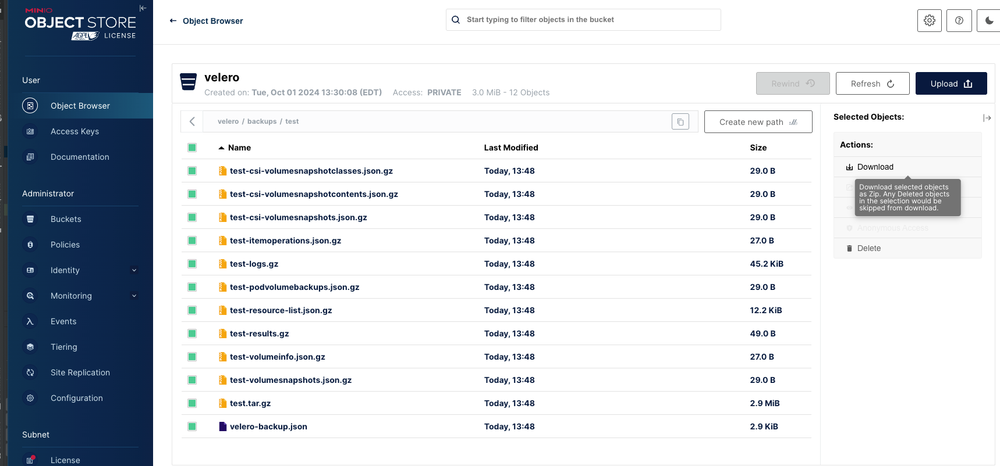

By default, MKE 4 stores backups and restores using the in-cluster storage
provider, the [MinIO addon](https://microk8s.io/docs/addon-minio).

> **Note**
> As of MKE 4.0.0 initial release, MinIO is not backed by persistent storage. For persistent storage of backups, please use an external storage provider or download the MinIO backup(s).

>The offered instructions assume that you have created a cluster and
applied a blueprint with the default MKE backup configuration.

## Create an in-cluster backup

To create an in-cluster backup, run:

```shell
mkectl backup create --name <name>
```

Example output:

```shell
mkectl backup create --name test
INFO[0000] Creating backup test...
Backup request "test" submitted successfully.
Run `velero backup describe test` or `velero backup logs test` for more details.
INFO[0000] Waiting for backup test to complete...
INFO[0003] Waiting for backup to complete. Current phase: InProgress
INFO[0006] Waiting for backup to complete. Current phase: InProgress
INFO[0009] Waiting for backup to complete. Current phase: InProgress
INFO[0012] Waiting for backup to complete. Current phase: InProgress
INFO[0015] Waiting for backup to complete. Current phase: Completed
```

The backup should be present in the MinIO bucket. To list the backups, run
the `mkectl backup list` command:

Example output:

```shell
mkectl backup list
NAME   STATUS      ERRORS   WARNINGS   CREATED                         EXPIRES   STORAGE LOCATION   SELECTOR
test   Completed   0        0          2024-05-07 17:29:18 -0400 EDT   29d       default            <none>
```

Optionally, you can view detailed logs of a backup by running the `mkectl
backup logs --name test` command.

## Restore from an in-cluster backup

To perform a restore using an in-cluster backup, run:

```shell
mkectl restore create --name test
```

Example output:

```shell
mkectl restore create --name test
INFO[0000] Waiting for restore test-20240507173309 to complete...
INFO[0000] Waiting for restore to complete. Current phase: InProgress
INFO[0003] Waiting for restore to complete. Current phase: InProgress
INFO[0006] Waiting for restore to complete. Current phase: InProgress
INFO[0009] Waiting for restore to complete. Current phase: InProgress
INFO[0012] Waiting for restore to complete. Current phase: InProgress
INFO[0015] Waiting for restore to complete. Current phase: InProgress
INFO[0018] Waiting for restore to complete. Current phase: InProgress
INFO[0021] Waiting for restore to complete. Current phase: InProgress
INFO[0024] Waiting for restore to complete. Current phase: InProgress
INFO[0027] Waiting for restore to complete. Current phase: Completed
INFO[0027] Restore test-20240507173309 completed successfully
```

To list the restores, run:

```shell
 mkectl restore list
 ```

Example output:

```shell
mkectl restore list
NAME                  BACKUP   STATUS      STARTED                         COMPLETED                       ERRORS   WARNINGS   CREATED                         SELECTOR
test-20240507173309   test     Completed   2024-05-07 17:33:09 -0400 EDT   2024-05-07 17:33:34 -0400 EDT   0        121        2024-05-07 17:33:09 -0400 EDT   <none>
```

Optionally, you can view detailed logs by running the
`mkectl restore logs --name test-20240507173309` command.

## Accessing the minio console

To access the MinIO console, first get the generated credentials from your cluster

To get the username:
```shell
kubectl --kubeconfig <path_to_kubeconfig> get secret -n mke minio-credentials -o jsonpath='{.data.root-user}' | base64 -d
```

To get the password:
```shell
kubectl --kubeconfig <path_to_kubeconfig> get secret -n mke minio-credentials -o jsonpath='{.data.root-password}' | base64 -d
```

Next, navigate to your ingress controller's external address under `/minio/` i.e (https://<external_address>/minio/) and login with the credentials you retrieved.

From there you should see a Velero bucket under the Object browser
You can then download or upload backups using the UI options provided.


