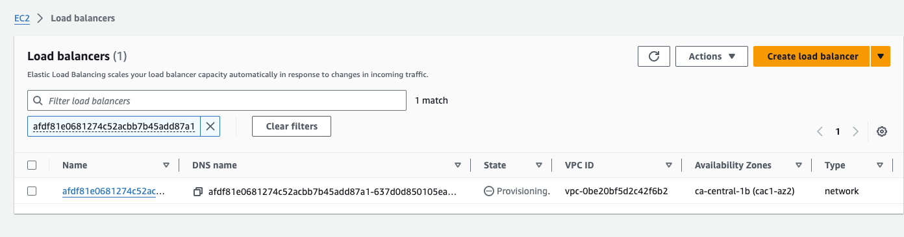

With MKE 4, you can deploy a cloud provider to integrate your MKE cluster with cloud provider service APIs.


AWS is currently the only managed cloud service provider add-on supported by MKE 4. To use a different cloud service provider, you must set MKE 4 to run with "external" cloud provider and install the desired cloud provider.


## Prerequisites
Refer to the documentation for your chosen cloud service provider to learn of any proprietary requirements.

For using the MKE managed AWS Cloud Provider you will need to ensure your nodes have certain IAM policies. See the official AWS cloud provider [documentation](https://cloud-provider-aws.sigs.k8s.io/prerequisites/#iam-policies).

## Configuration

CloudProvider support is disabled by default. To enable CloudProvider support, configure

```yaml
  cloudProvider:
    enabled: true
    provider: aws
```

**Configuration parameters**

| Field    | Description                                                                                                             | Default |
|----------|-------------------------------------------------------------------------------------------------------------------------|---------|
| enabled  | Enables cloud provider flags on mke components.                                                                         | false   |
| provider | Either "aws" or "external". If "external" is specified the user is responsible for installing their own cloud provider. | ""      |


## Example: Create an NLB with Cloud Provider AWS

Here is an example of how to use cloud provider AWS to create a Network Load Balancer (NLB) in your MKE cluster. 

Once you have enabled the cloud provider in your MKE configuration, and applied the mke configuration, you can create an NLB using the following steps:


1. Create a sample nginx deployment
```shell
cat <<EOF | kubectl --kubeconfig ~/.mke/mke.kubeconf apply -f -
apiVersion: apps/v1
kind: Deployment
metadata:
  name: nginx-deployment
spec:
  replicas: 3  
  selector:
    matchLabels:
      app: nginx
  template:
    metadata:
      labels:
        app: nginx
    spec:
      containers:
      - name: nginx-container
        image: nginx:latest
        ports:
        - containerPort: 80
EOF
```

2. Create a service of type LoadBalancer
```shell
cat <<EOF | kubectl --kubeconfig ~/.mke/mke.kubeconf apply -f -
apiVersion: v1
kind: Service
metadata:
  name: nginx-service
  annotations:
    service.beta.kubernetes.io/aws-load-balancer-type: nlb
spec:
  selector:
    app: nginx
  ports:
    - protocol: TCP
      port: 80
      targetPort: 80
  type: LoadBalancer
EOF
```

3. Check the status of the service
```shell
kubectl --kubeconfig ~/.mke/mke.kubeconf get service
NAME            TYPE           CLUSTER-IP     EXTERNAL-IP                                                                        PORT(S)        AGE
kubernetes      ClusterIP      10.96.0.1      <none>                                                                             443/TCP        14m
nginx-service   LoadBalancer   10.96.177.89   afdf81e0681274c52acbb7b45add87a1-637d0d850105ea92.elb.ca-central-1.amazonaws.com   80:32927/TCP   63s
```

4. Load balancer should be created and visible in AWS console.

   

5. After some time, the load balancer should finish provisioning and we should be able to access nginx via the external IP.
